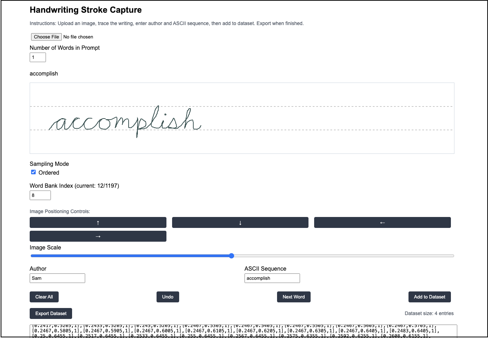

# Cursive Transformer

_Note (July 5, 2024): this repo is under active development and thus subject to rapid breaking changes._

## Making a dataset

Let's construct a dataset of cursive pen strokes for training a handwriting model. I don't have an e-pen or any special hardware. Also, someday I want to allow people to clone their own handwriting in a demo. Thus this is a strictly mouse-based interface.

The `collect.html` is a simple webpage that allows users to upload examples of cursive handwriting, position those images in the tracing region, trace them with a pen, annotate the author and ASCII characters, and export the result as a JSON file. They can also prompt themselves with words from a word bank and contribute penmanship of their own.

## Preprocessing and Tokenization

Our raw dataset consists of a large JSON file consisting of examples. Each example contains ASCII characters, stroke information, and some metadata like who the author was. Let's visualize one of these examples: this particular one was traced from a screenshot taken of the [Zaner-Bloser cursive practice workbook](static/Zaner-Bloser.pdf). Since we have to represent (`dx`, `dy`, `magnitude`, and `is_pen_down`) for every step, we opt to unroll each step into three tokens: the first represents `dx`, the second represents `dy`, and the third represents a combination of `magnitude` and `is_pen_down`. This is a little messy, but it allows us to leave the boilerplate Transformer training code completely unchanged.

## Training and Logging

The model definition is Karpathy's [`makemore`](https://github.com/karpathy/makemore/blob/master/makemore.py) Transformer architecture plus cross-attention for conditioning on ASCII data. The training code is also inspired by the [`makemore`](https://github.com/karpathy/makemore/blob/master/makemore.py) repo but I've added Weights and Biases for better logging and visualization of sample handwriting.

## Samples

This section is a work in progress. The samples shown here were generated by conditioning on ASCII characters from the test set. As of now, I've been able to show that the ASCII information is able to effectively condition what the model generates via cross-attention. You'll notice that the model garbles some characters and often generates them out of order -- it has not yet truly solved the task. However, I'm pleased to have gotten this far with a train/test set of 270/30 examples and some bit of data augmentation.

